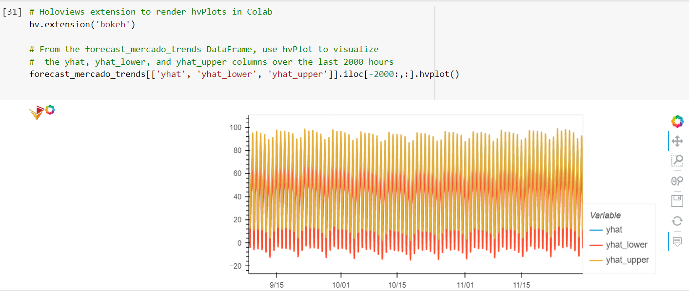
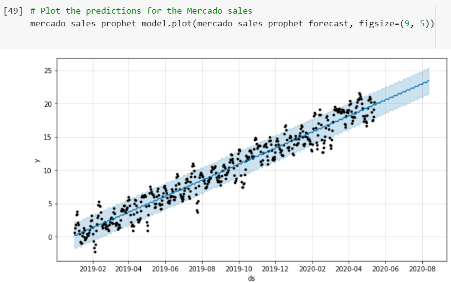

<<<<<<< HEAD
# FinTech Growth Analyst Using Google CoLAb and Facebook Prophet to Forecast

*"Welcome to my FinTech project as a 'Growth Analyst' forecasting net prophet at an e-commerce company."*

---

## Background

This project constructs a program to seek predictive growth avenues for e-commerce company MercadoLibre 's stock by analyzing user search data.  To make predictable forecast models, search traffic data is mined for unusual patterns and seasonality factors to find some correlation with historical stock price movement overtime. Employing python and pandas functions of ‘datetime’ objects eases forecasts using time series models through FaceBook Prophet for non-linear trends, which are observed with seasonal effects and historical data.  

The exponential growth of e-commerce companies is becoming increasingly more competitive not only with their industry peers, but also financially. Stock analysts have traditionally measured brick and mortar companies with ‘foot traffic’, while comparatively e-commerce companies are measured by clicks with ‘search traffic’.  Conventional wisdom translates comparative metrics from ‘bricks to clicks’ for online ‘search traffic’ trends. This serves as an indicator of increasing or decreasing revenue interpreting it as a predictor of rising or falling stock prices.  

The increasing investor interest in foreign e-commerce companies abroad made popular by ‘Amazon’, ‘eBay’ and ‘PayPal’ seek to replicate historical high growth returns in less developed markets. LATAM diversification has made this asset class popular for portfolios searching for companies like Mercado Libre to balance portfolios. As such, analyzing clicks of internet search traffic to find a relation with stock price can attract investor interest and strengthen financial capitalization with analysts’ recommendations.  

The FinTech app technology in this program utilizes Google Colab as the IDE for Jupyter Notebook in the cloud, with Python language and Pandas’ libraries to analyze and manipulate time series data. Its purpose is to find patterns and correlation between non-linear variables to ascertain predictable relationships.  FB Prophet is used to analyze historical time series data and fit non-linear trends into a times series model to find seasonal effects with historical data and make forecasts. The forecast model of time series data can then be used to make presumptions about search traffic trends and future stock price movements. 
 

---

## Technologies

The software operates on python 3.9 with the installation package imports embedded with Anaconda3 installation. Google Colab is an IDE that creates an interactive environment to write Python code on the ‘Colab notebook’, which hosts the ‘Jupyter notebook’ in the cloud. This allows the notebook to be saved into one’s Google Drive account for safe storage, easy access anywhere and be shared with others. The tools that you need for this module, include [fbprophet], [datetime], [pystan] and [pyviz hvplot] libraries. 

To work with time series data Python and Pandas supply functions through the [datetime] objects. For forecasting [fbprophet] is used with its dependency [pystan]. 'PyViz' is a single platform for accessing multiple visualization libraries from Python which needs installation of [hvPlot] and its dependency [holoviews] for charting in this program. 

* [anaconda3](https://docs.anaconda.com/anaconda/install/windows/e) 

* [GoogleColab](https://colab.research.google.com/) 

*  [FBProphet](https://facebook.github.io/prophet/) 

* [pyviz hvplot](https://hvplot.holoviz.org/index.html#) .

.

---

## Installation Guide

Before running the applications first navigate to [Google Colab](https://colab.research.google.com/) the drive must be mounted with google colab as coded in A1 below. Then it needs configuration by installing the ‘python’, ‘fbprophet’, and ‘hvplot’ libraries below and import them. To utilize ‘.csv’ files ‘google colab drive’ must be mounted as coded in B1 procedure below.  

Also, because of Colab’s interactive nature it renders charts differently than Jupyter notebook and to avoid an empty chart follow C1 below.  


```python libraries
!pip install pystan
!pip install fbprophet
!pip install hvplot
!pip install holoviews
```
```from pathlib import Path
import pandas as pd 
import hvplot.pandas 
import holoviews as hv 
import datetime as dt
from fbprophet import Prophet 
import numpy as np

A1) To mount the drive with Colab run the following command: 
        [from google.colab import drive]
        [drive.mount('/content/drive')]

    2) confirm the mount: [Mounted at /content/drive]

B1) To upload .csv files from your computer to Google Colab enter the following command: 
        [from google.colab import files]  
        [uploaded = files.upload()]

C1) To utilize holoviews charts enter the code before each hvplot:    
        [hv.extension('bokeh)]


```

---
# Usage

This application is launched from web-based Google Colab cloud utilizing Pandas which is designed for data analysis to write and read code in an IDE and review results through the Python libraries. The Anaconda3 software application includes the Pandas libraries; **'PyViz' including ‘hvPlot’.** They are utilized for high-level plot charts for this program from the Python visualization package. **Holoviews** imported from the Bokeh library for **hvplot** to run charts in Colab. 

The program is developed in Colab notebook on a jupyter **.ipny** file. The **fbprophet** library makes it possible to forecast using pandas timeseries data using algorithms and statistical models to assist in making future decisions from non-linear variables. 
 

 

 


```python
forecasting_net_prophet.ipynb
```
 

---

## Contributors

*Provided to you by digi-Borg FinTek*, 
Dana Hayes: nydane1@gmail.com

---

## License

Columbia U. Engineering


=======
# FinTech Growth Analyst Using Google CoLAb and Facebook Prophet to Forecast

*"Welcome to my FinTech project as a 'Growth Analyst' forecasting net prophet at an e-commerce company."*

---

## Background

This project constructs a program to seek predictive growth avenues for e-commerce company MercadoLibre 's stock by analyzing user search data.  To make predictable forecast models, search traffic data is mined for unusual patterns and seasonality factors to find some correlation with historical stock price movement overtime. Employing python and pandas functions of ‘datetime’ objects eases forecasts using time series models through FaceBook Prophet for non-linear trends, which are observed with seasonal effects and historical data.  

The exponential growth of e-commerce companies is becoming increasingly more competitive not only with their industry peers, but also financially. Stock analysts have traditionally measured brick and mortar companies with ‘foot traffic’, while comparatively e-commerce companies are measured by clicks with ‘search traffic’.  Conventional wisdom translates comparative metrics from ‘bricks to clicks’ for online ‘search traffic’ trends. This serves as an indicator of increasing or decreasing revenue interpreting it as a predictor of rising or falling stock prices.  

The increasing investor interest in foreign e-commerce companies abroad made popular by ‘Amazon’, ‘eBay’ and ‘PayPal’ seek to replicate historical high growth returns in less developed markets. LATAM diversification has made this asset class popular for portfolios searching for companies like Mercado Libre to balance portfolios. As such, analyzing clicks of internet search traffic to find a relation with stock price can attract investor interest and strengthen financial capitalization with analysts’ recommendations.  

The FinTech app technology in this program utilizes Google Colab as the IDE for Jupyter Notebook in the cloud, with Python language and Pandas’ libraries to analyze and manipulate time series data. Its purpose is to find patterns and correlation between non-linear variables to ascertain predictable relationships.  FB Prophet is used to analyze historical time series data and fit non-linear trends into a times series model to find seasonal effects with historical data and make forecasts. The forecast model of time series data can then be used to make presumptions about search traffic trends and future stock price movements. 
 

---

## Technologies

The software operates on python 3.9 with the installation package imports embedded with Anaconda3 installation. Google Colab is an IDE that creates an interactive environment to write Python code on the ‘Colab notebook’, which hosts the ‘Jupyter notebook’ in the cloud. This allows the notebook to be saved into one’s Google Drive account for safe storage, easy access anywhere and be shared with others. The tools that you need for this module, include [fbprophet], [datetime], [pystan] and [pyviz hvplot] libraries. 

To work with time series data Python and Pandas supply functions through the [datetime] objects. For forecasting [fbprophet] is used with its dependency [pystan]. 'PyViz' is a single platform for accessing multiple visualization libraries from Python which needs installation of [hvPlot] and its dependency [holoviews] for charting in this program. 

* [anaconda3](https://docs.anaconda.com/anaconda/install/windows/e) 

* [GoogleColab](https://colab.research.google.com/) 

*  [FBProphet](https://facebook.github.io/prophet/) 

* [pyviz hvplot](https://hvplot.holoviz.org/index.html#) .

.

---

## Installation Guide

Before running the applications first navigate to [Google Colab](https://colab.research.google.com/) the drive must be mounted with google colab as coded in A1 below. Then it needs configuration by installing the ‘python’, ‘fbprophet’, and ‘hvplot’ libraries below and import them. To utilize ‘.csv’ files ‘google colab drive’ must be mounted as coded in B1 procedure below.  

Also, because of Colab’s interactive nature it renders charts differently than Jupyter notebook and to avoid an empty chart follow C1 below.  


```python libraries
!pip install pystan
!pip install fbprophet
!pip install hvplot
!pip install holoviews
```
```from pathlib import Path
import pandas as pd 
import hvplot.pandas 
import holoviews as hv 
import datetime as dt
from fbprophet import Prophet 
import numpy as np

A1) To mount the drive with Colab run the following command: 
        [from google.colab import drive]
        [drive.mount('/content/drive')]

    2) confirm the mount: [Mounted at /content/drive]

B1) To upload .csv files from your computer to Google Colab enter the following command: 
        [from google.colab import files]  
        [uploaded = files.upload()]

C1) To utilize holoviews charts enter the code before each hvplot:    
        [hv.extension('bokeh)]


```

---
# Usage

This application is launched from web-based Google Colab cloud utilizing Pandas which is designed for data analysis to write and read code in an IDE and review results through the Python libraries. The Anaconda3 software application includes the Pandas libraries; **'PyViz' including ‘hvPlot’.** They are utilized for high-level plot charts for this program from the Python visualization package. **Holoviews** imported from the Bokeh library for **hvplot** to run charts in Colab. 

The program is developed in Colab notebook on a jupyter **.ipny** file. The **fbprophet** library makes it possible to forecast using pandas timeseries data using algorithms and statistical models to assist in making future decisions from non-linear variables. 
 

 

 


```python
forecasting_net_prophet.ipynb
```
 

---

## Contributors

*Provided to you by digi-Borg FinTek*, 
Dana Hayes: nydane1@gmail.com

---

## License

Columbia U. Engineering


>>>>>>> b9d57d6932c7a2955ea36e7cb11f70e9be46f990
